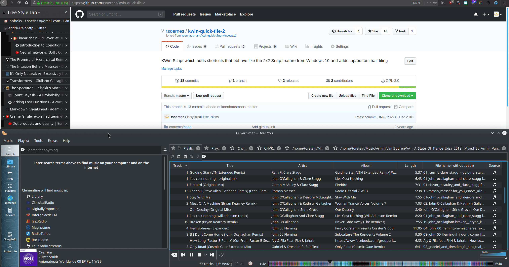

This KWin Script extends the quick tiling functionality in KDE. It adds four shortcuts which behave similarly to the 2x2 Snap feature in Windows 10, 
and in addition allows tiling windows to the top or the bottom half of the screen.

Tested and compatible with multi-monitor setups.

Quick Tile 2 is available on the [openDesktop KDE store](https://www.opendesktop.org/p/1259484/), othwerwise you can follow the installation instructions below.


## Installation

1. Clone the repo
```
git clone https://github.com/tsoernes/kwin-quick-tile-2.git && cd kwin-quick-tile-2
```
_or_ [download the zip](https://github.com/tsoernes/kwin-quick-tile-2/releases) and extract it.

2. `cd` into the `kwin-quick-tile-2` folder.

3. Execute the following command in the `kwin-quick-tile-2` folder:
```
sh install.sh
```
4. Open `KWin Scripts` from the start menu and enable Quick Tile 2.
## How to use
Default keys are <Meta + Arrow>, for example <Meta + Up>, as in Windows 10, where the Meta key is also known as the Super key or Windows key.
If the keys are already bound, you need to set them in "Global Shortcuts" from the start menu. The shortcuts are prefixed "Quick Tile 2".
They are usually to be found in the KWin shortcut tab, but on some systems they end up in the System Settings tab.

## Manual installation and packaging

Should something go wrong with the above script, you can try to manually package and install it.
To package this kwin-script into a .kwinscript archive, execute:

```
zip -r quick-tile-2-v$(cat metadata.desktop | grep X-KDE-PluginInfo-Version= | awk -F'=' '{print $2}').kwinscript *
```

To install the archive, execute:
```
plasmapkg2 --type kwinscript -i quick-tile-2-v*.kwinscript
```
Alternatively, open "KWin scripts" from the start menu and then "Import KWin script ..."
Afterwards, you might need to log in and out.
